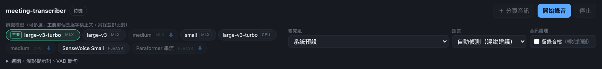
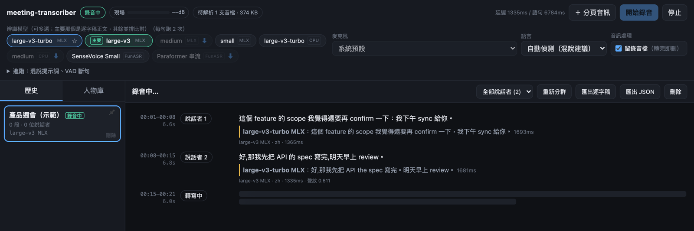
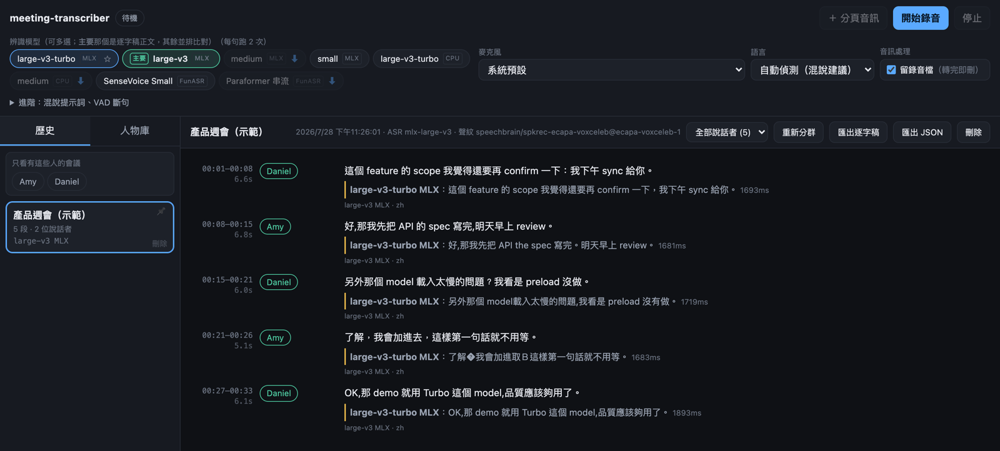
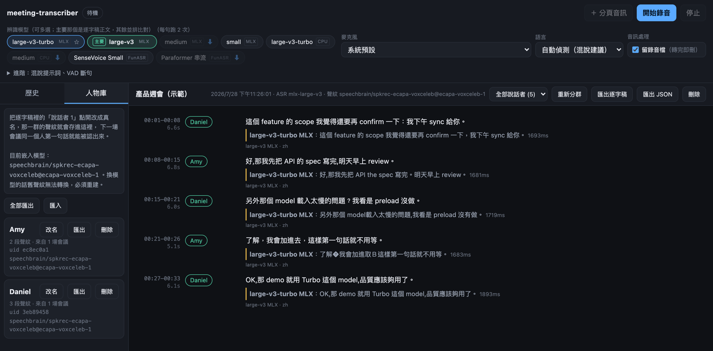
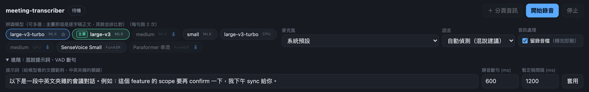

# MeetingTranscriber

即時會議逐字稿工具，跑在自己的電腦上。麥克風進來的聲音在本機切句、轉文字、
比對聲紋，音訊不上傳任何地方，也不留音檔。

為什麼自己寫一個：市面上的服務都要把整場會議的音訊送上雲端，而中英夾雜
（code-switching）的表現又只能實測才知道——同一段話餵給不同模型的結果差很多，
沒有一個通用答案。所以這個工具把「模型可以隨時換、可以並排比對」做成主要功能，
而不是藏在設定裡。

- 即時逐字稿，支援中英夾雜
- 說話者自動分群（說話者 1 / 2 / 3），可改真名並跨會議記住
- 多個模型並排轉寫同一句話，直接比品質
- 歷史會議可瀏覽、編輯、依說話者篩選、匯出
- Whisper（MLX / CPU）、SenseVoice、Paraformer 可切換；聲紋用 ECAPA-TDNN

---

## 怎麼操作

### 1. 勾模型



chip 上的小標籤是**後端**：`MLX` 走 Apple Silicon GPU，`CPU` 走 ctranslate2
（macOS 沒有 Metal 後端，明顯較慢，留著是跨平台對照用）。

- 標著 **主要** 的那個是逐字稿正文，其餘每一句都會再跑一次並排顯示
- 有 **⬇** 代表還不能用：缺套件的會跑 `pip install`（裝進跑伺服器的那個 Python），
  套件有了但權重沒下載的則開始抓權重。兩種都即時顯示進度，完成後可以勾選，不用重開
- 勾選之後模型**立刻載進記憶體**，不是等按下開始錄音才載——第一次載入要暖機，
  放到錄音之後就會變成你在講話卻沒有逐字稿

### 2. 錄音中



一句話進了轉寫佇列，逐字稿上就先出現一列骨架（`轉寫中`），轉好才換成文字，
所以「有沒有收到我這句話」隨時看得出來。右上角是最後一句的推論延遲與語句長度；
`待解析 N 支音檔` 往上跑代表 ASR 落後了。

### 3. 逐字稿



- 每段標出**起訖時間與時長**
- 點一下說話者膠囊就能改成真名（見下一節）
- 黃線那一行是**其他模型對同一句話的輸出**。上圖裡 large-v3 寫「API 的 spec」，
  turbo 寫成「API the spec」——這就是並排比對存在的理由
- 文字可以直接點進去改，存回資料庫並標記「已修」
- 右上角可依說話者篩選、重新分群、匯出逐字稿或 JSON

### 4. 命名說話者與人物庫



把「說話者 1」改成真名之後，那一群的聲紋向量就存進人物庫，
**下一場會議同一個人第一句話就會被認出來**。人物的身分是 `uid` 而不是名字——
名字只是標籤，可以改、可以重複。換機器時「全部匯出」得到一個 JSON，
到新機器匯入即可，不必重新收集聲紋。

分群在會議開頭最不準（群心還沒收斂），程式每隔幾句會自動全域重算並
**回頭修正前面標錯的段落**（畫面會閃一下），也可以手動按「重新分群」。

### 5. 進階：提示詞與斷句



**提示詞**對中英夾雜影響很大。whisper 的 decoder 本質上是語言模型，一個字一個字
續寫，同時參考聲音特徵和「已經寫出來的文字」。提示詞的作用是假裝前面已經有一段
文字，讓它模仿那個**文體**——包括要不要混用兩種語言。所以提示詞不是在描述
「這段音檔講什麼」，而是在說「用什麼文體寫下來」。寫成你平常講話的樣子最有效。

`靜音斷句` 是語句結束的判定門檻，也是定稿延遲的下限；`暫定稿間隔` 是語句還在
進行中時，每隔多久重跑一次目前累積的音訊。

### 6. 收系統音訊（線上會議對方的聲音）

麥克風收不到對方的聲音——那是從喇叭出去的。這裡不需要安裝虛擬音訊裝置：

1. 先按「開始錄音」（分頁音訊是加到目前這場會議上的一條**軌**）
2. 按右上角 `＋ 分頁音訊`
3. Chrome 的選擇視窗切到「Chrome 分頁」，挑放 YouTube / Google Meet 的那個分頁
4. **一定要勾左下角「同時分享分頁音訊」**，不勾就只有畫面沒有聲音

之後麥克風與分頁音訊同時收，逐字稿分成「現場」與「遠端」，遠端段落左邊有一條
藍線、說話者標成「遠端 1」。限制是只抓得到 Chrome 分頁裡的聲音，桌面版 Zoom、
Teams App 抓不到。

---

## 架構

```
麥克風 (sounddevice callback) ──→ mic 軌佇列 ──┐
分頁音訊 (WebSocket, 16k PCM) ─→ system 軌佇列 ┤
                                               ├→ 每軌一條 VAD 執行緒（切語句）
                                               ↓
                                共用的一條 ASR 工作執行緒
                                               ↓
                          ECAPA 聲紋 → 線上分群（每軌獨立）
                                               ↓
                          SQLite（逐字稿＋每段向量）→ 事件佇列 → WebSocket → 瀏覽器
```

| 檔案 | 負責 |
|------|------|
| `src/mt/audio.py` | 麥克風擷取，統一輸出 16 kHz / mono / float32；裝置列舉、調變深度 |
| `src/mt/vad.py` | Silero VAD 切語句，產生「暫定稿」與「定稿」兩種 Utterance |
| `src/mt/asr.py` | 可切換的 ASR 後端註冊表（MLX / faster-whisper / FunASR）與幻覺防治 |
| `src/mt/spk.py` | ECAPA 聲紋、線上分群、人物庫開集比對、全域重新分群 |
| `src/mt/store.py` | SQLite：會議、段落、每段向量、說話者、人物庫、匯入匯出 |
| `src/mt/pipeline.py` | 把上面全部串起來的 Session；多軌、佇列、反壓、事件 |
| `src/mt/server.py` | FastAPI，只綁 `127.0.0.1`；HTTP API ＋ 兩個 WebSocket |
| `src/mt/web/index.html` | 單檔前端（無框架、無外部資源） |
| `src/mt/cli.py` | `serve` / `models` / `mic` / `file` / `compare` |

## 幾個關鍵設計決定

**麥克風與系統音訊分軌，不混成單軌。** 系統音訊裡是遠端參與者、麥克風裡是現場的
人，分軌讓「現場 vs 遠端」免費切乾淨，分群只需在各軌內部做。混成單軌反而會因兩
個來源的通道特性差異，把同一個人分成兩群。說話者代號因此也分前綴（現場 `1`、
遠端 `R1`）。

**ASR 只有一條工作執行緒。** GPU 推論本來就是序列化的，多開只會互搶資源並讓延遲
更難預測。反之 VAD 必須每軌獨立且與 ASR 分離——ASR 一句要數百毫秒，擠在一起會讓
語句邊界判斷跟著延遲，愈跑愈歪。

**暫定稿 / 定稿兩段式，因為 whisper 不是真串流。** 用 VAD 找語句邊界，語句結束才
做定稿轉寫；語句進行中則每隔一段時間把目前累積的音訊重跑一次當暫定稿。延遲因此
來自暫定稿間隔而不是模型，而定稿永遠是在完整語句上做的，不會有固定切窗把字切一半
的問題。代價是同一段音訊會被轉寫多次，所以 ASR 一忙就先丟暫定稿。

**已輸出的段落必須可以被改寫。** 線上分群開頭最不準，唯一的救法是累積足夠向量後
用階層式分群全域重算，把前面標錯的段落改回來。UI 因此不能是 append-only 的捲動
列表，而是 `id → DOM` 的索引就地更新。

**聲紋向量在會議進行時就落地，而且帶模型版本。** 不留音檔，所以事後改名時沒有音訊
可以重算——向量必須和逐字稿在同一個 transaction 寫進資料庫。向量也一定要記下嵌入
模型與版本（`EMBED_TAG`），否則換模型後舊向量會被當成新向量混用，症狀是比對分數
莫名下降，極難診斷。

**人物庫的門檻明顯高於分群門檻。** 把陌生人誤標成「Daniel」比留在「說話者 1」糟糕
得多，所以人物比對要求分數夠高、而且要明顯贏過第二名，否則寧可不認。太短的語句
也不准開新說話者——實測一句 1.6 秒的話，聲紋跟同一個人其他段落的相似度只有
0.14~0.31，比不同人之間還低，那種向量只會製造一堆假的說話者。

**系統音訊走瀏覽器，不走 BlackHole。** macOS 要收系統音訊原本得裝虛擬音訊裝置，
而那需要管理者權限。Chrome 的 `getDisplayMedia` 可以擷取分頁音訊，不必安裝任何
東西、不必改系統聲音設定。取樣率轉換交給 `AudioContext({sampleRate: 16000})`，
AudioWorklet 只負責混單聲道並累積成塊。

**幻覺與重複迴圈是分四層擋的。** whisper 在貪婪解碼下會吐出同一句話幾十次，
在非語音片段上還會硬湊出字：溫度回退（靠壓縮比偵測）＋ 壓縮比超標的段直接丟 ＋
尾端 n-gram 迴圈後處理 ＋ 語音閘門（看音量的調變深度而不是振幅，語音有音節起伏、
噪音是平的）。也刻意不做自動增益——放大底噪只會讓 VAD 誤判成語音。

**錄音模式是一個明確的取捨。** 預設關閉：音訊完全不落地，代價是模型跟不上時會丟
音訊，而丟音訊的後果不是「少一段」而是「句子缺字」，比空白更難發現。打開的話每
一句先寫成暫存檔、轉完立刻刪除，磁碟上永遠只有還沒轉完的部分。

## 資料模型（SQLite）

| 表 | 內容 |
|----|------|
| `meetings` | 一場會議：標題、起訖、ASR 模型、嵌入模型與維度、是否置頂 |
| `segments` | 一句話：時間、文字、軌、說話者代號、語言、哪個模型轉的、是否被手改過 |
| `segment_alts` | 同一句話由其他模型轉出的結果，一個模型一列（並排比對） |
| `segment_embeddings` | 逐段聲紋向量。存每段而非只存群心，重新分群與事後命名都需要原始向量 |
| `speakers` | 這場會議裡的說話者代號 → 顯示名稱 / 人物 |
| `people` | 跨會議的人物：`uid` 是身分，`name` 只是標籤 |
| `person_vectors` | 人物的聲紋向量，記得來自哪一場會議 |

## 限制

- MLX 後端只在 Apple Silicon 上有 GPU 加速；ctranslate2 在 macOS 只有 CPU，明顯較慢
- 分頁音訊只抓得到 Chrome 分頁裡的聲音
- 換了嵌入模型，舊聲紋無法轉換（因為不留音檔），匯入時會直接擋下來而不是靜默混用
- 尚未有自動化測試；模型品質的驗證靠 `run.py compare` 與 UI 上的並排比對

安裝與指令請看 [README](README.md)。
